# Credit Risk Analysis

## Overview

### Background
Credit risk is a largely unbalanced classification problem. Far more good loans exist than risky loans, so it is important to have the proper model when determining good vs bad credit risk.
### Purpose
The purpose of this analysis is to use a credit card credit dataset from LendingClub to compare models:
- RandomOverSampler
- SMOTE
- ClusterCentroids
- SMOTEENN
- BalancedRandomForestClassifier
- EasyEnsembleClassifier
  
## Results
- Random Oversampler
  - Balanced Accuracy Score: 0.657
  - Precision: 0.01
  - Recall: 0.71
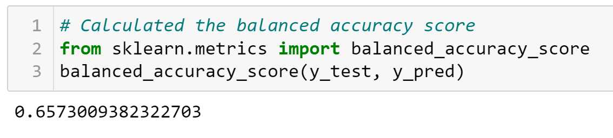
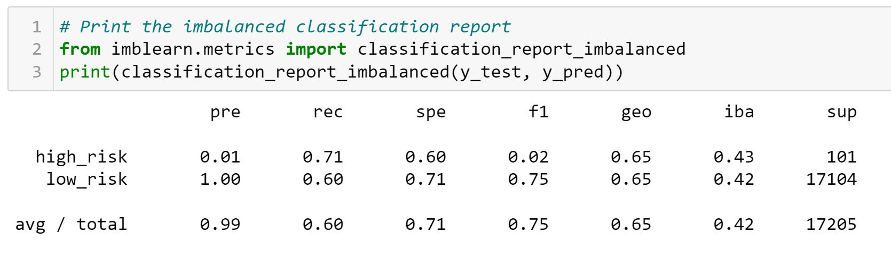
- SMOTE
  - Balanced Accuracy Score: 0.662
  - Precision: 0.01
  - Recall: 0.63
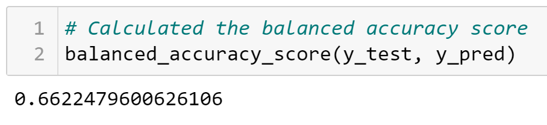
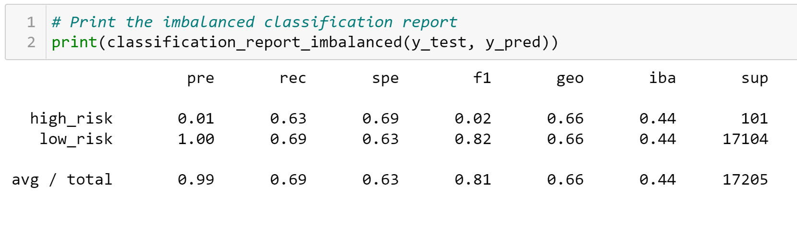
- ClusterCentroids
  - Balanced Accuracy Score: 0.544
  - Precision: 0.01
  - Recall: 0.69
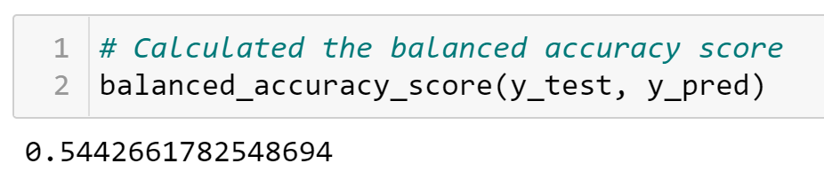
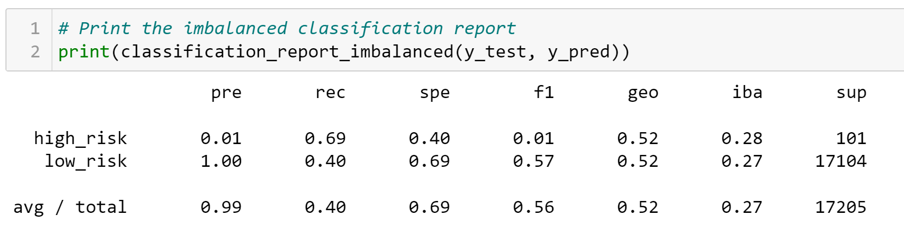
- SMOTEEENN
  - Balanced Accuracy Score: 0.545
  - Precision: 0.01
  - Recall: 0.69
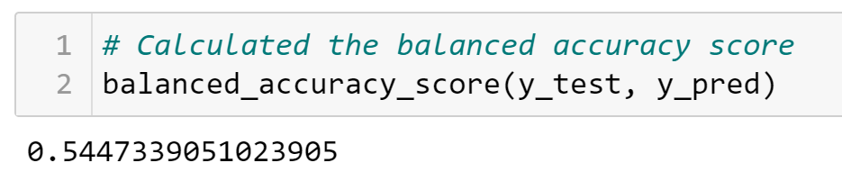
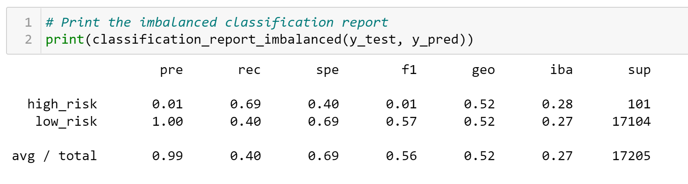
- BalancedRandomForestClassifier
  - Balanced Accuracy Score: 0.789
  - Precision: 0.03
  - Recall: 0.70
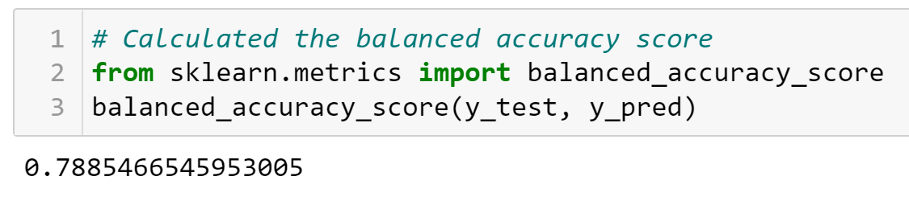
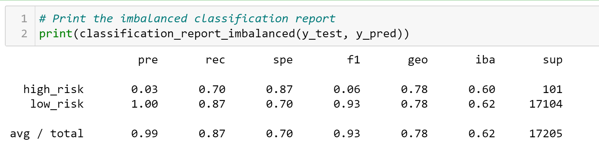
- EasyEnsembleClassifier
  - Balanced Accuracy Score: 0.932
  - Precision: 0.09
  - Recall: 0.92
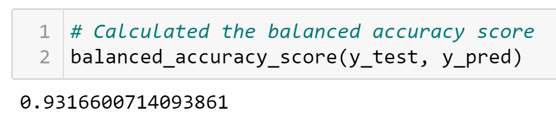
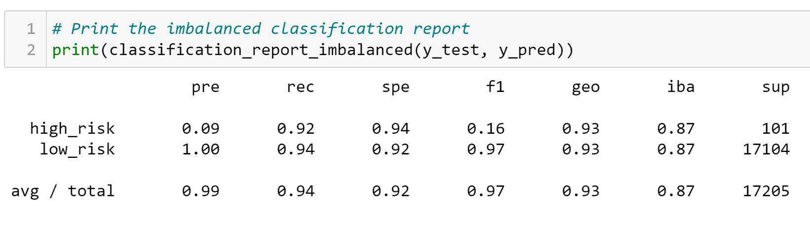
## Summary
Based on the results gained from running the models on the dataset, I can conclude that all of the models have varying levels of recall, but all have very poor precision. This means that when using the models to find high-risk credit history there will be many false positives. This may be ok, if credit found to be high-risk is put through further testing to see if it is actually high risk. For recall, it is far better to have a high score, resulting in few false negatives. False negatives in this case would potentially result in loans being given to people with high credit risk. Based on this, most of the models that have a pore recall score (RandomOversampler, SMOTE, ClusterCentroids, SMOTEENN) would be bad models for finding credit risk. I would recommend using the EasyEnsembleClassifier model for finding credit risk based on its Recall score of 0.92 meaning there are very few false negatives. 
